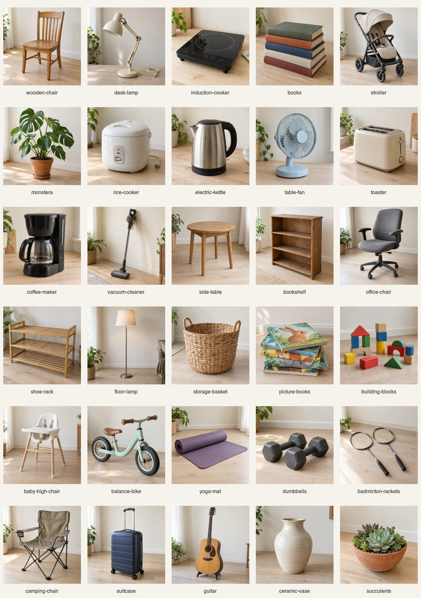

# 邻里闲置商品演示图片

30 张独立方形 PNG，由内置 `image_gen.imagegen` 逐张生成。自然居家摄影风格，柔和自然光、轻微使用感、主体完整。全部是 **AI 生成演示图片**，不是实际在售商品照片；画面不作为品牌、功能、性能或安全认证依据。

## 文件与接入

- `<slug>.png`：生成工具原始 PNG，未裁切、重绘或压缩。
- `manifest.json`：30 条素材记录，包含稳定 slug、中文名称、分类、画面描述、alt、AI 标注、完整提示词、尺寸、字节数和 SHA-256。
- `contact-sheet.jpg`：5 × 6 总览，仅作浏览；30 张独立原图均单独保存。
- `validation.json`：文件数量、完整解码、尺寸、唯一性和视觉检查记录。

`file` 相对于此目录，`pathBase` 相对于仓库根目录。分类仅用于素材整理。slug 是素材标识，不自动扩展业务 `imageKey` 白名单；接入和契约映射由协调任务统一处理。本次仅交付素材，不修改前端、后端或共享契约。

接入时保留可见的“AI 生成演示图片”说明。对于页面加载，可由前端另行制作压缩衍生图，同时保留此处原图。

## 总览

## 验证

2026-09-27：30 个唯一 slug、30 个唯一 SHA-256、30 张 PNG 全部通过 ImageMagick 完整解码并确认为方形；已逐张查看主体和整体构图，对应全部 30 个主题。未发现明显品牌、水印或人物。原图保留生成细节，不能用于实物质量鉴定。详细尺寸与哈希见 manifest。

生成方式仅使用内置工具，无 CLI/API 生图调用。每张实际提示词记录在 manifest 对应条目的 `prompt`。
