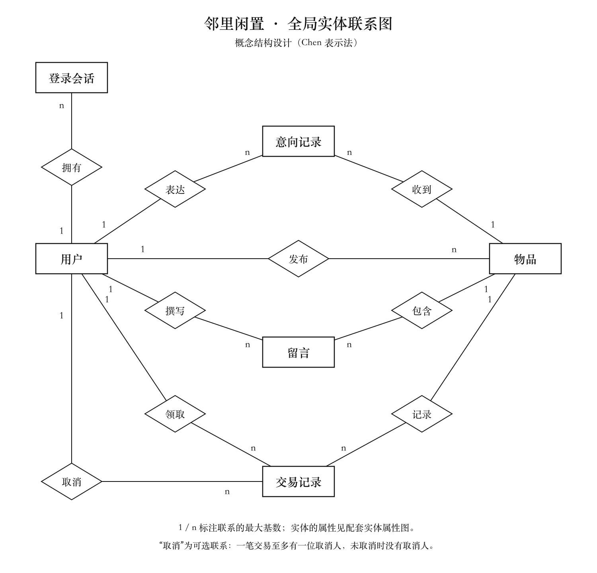
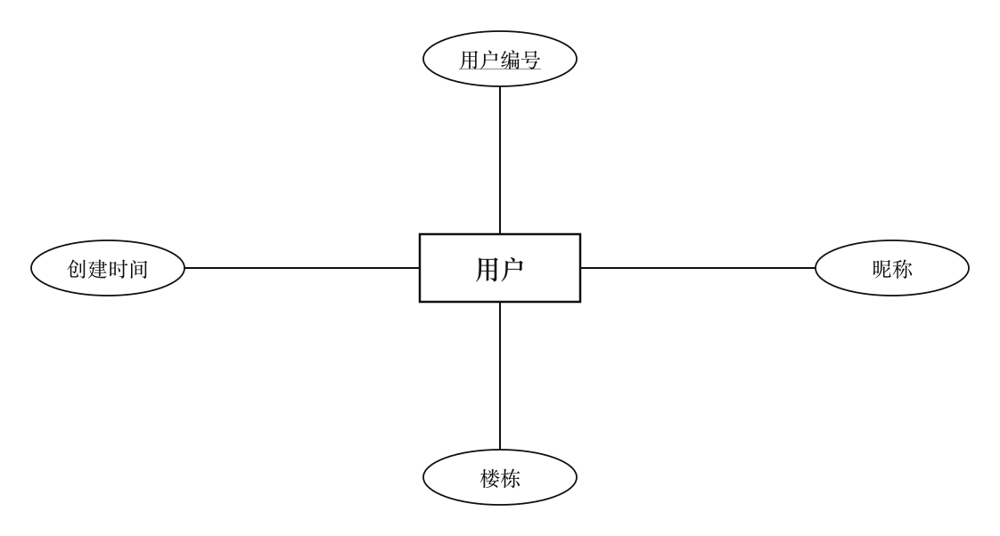
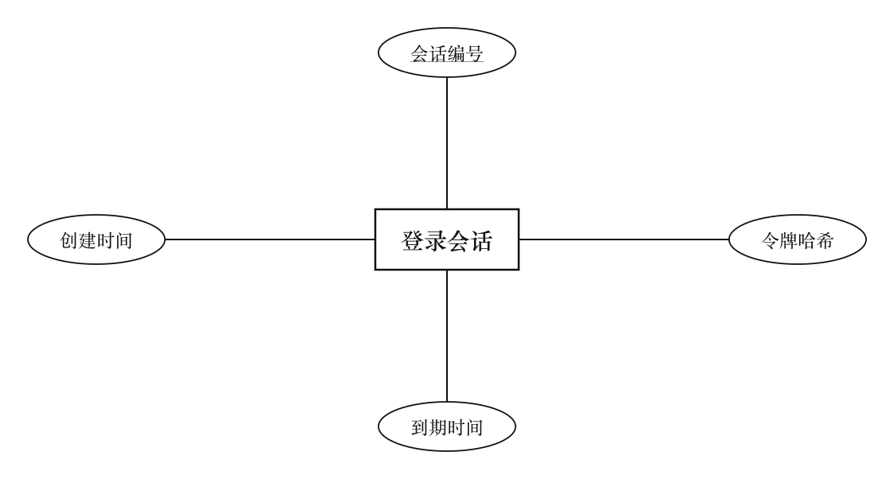
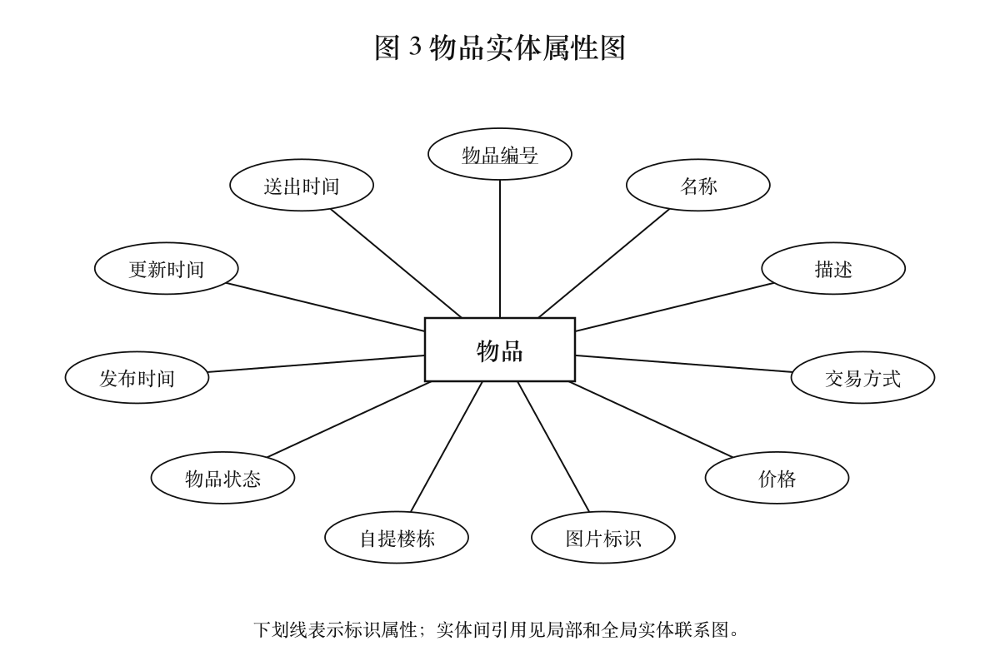
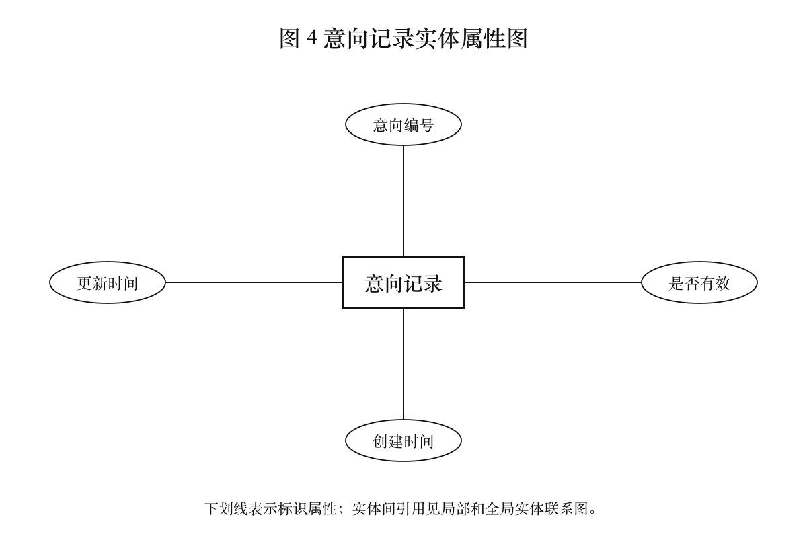
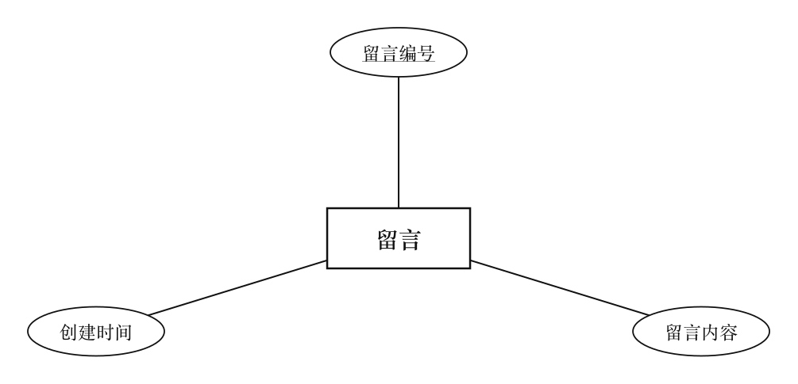
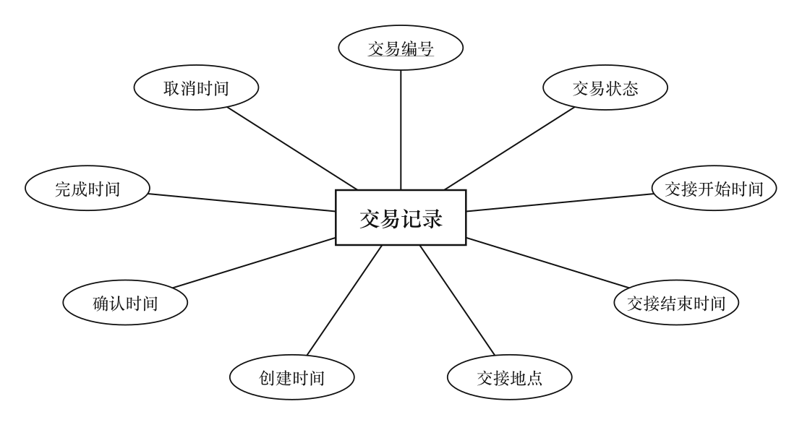
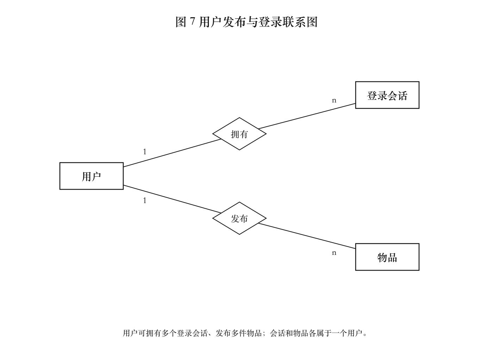
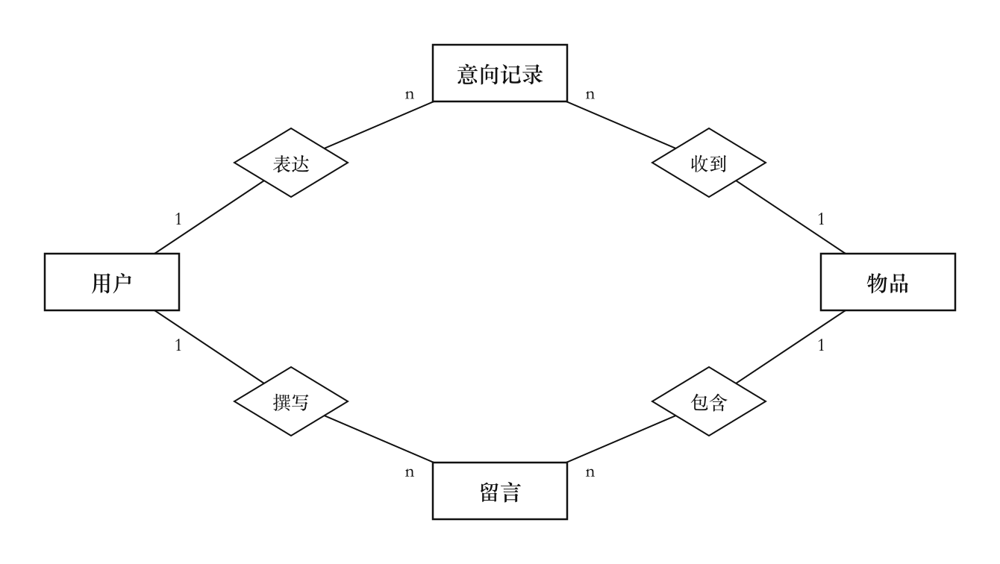
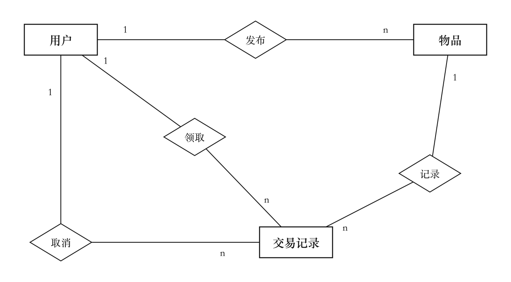

# 数据库 E-R 图（Chen 表示法）

本项目采用参考实验报告中的概念结构表示方式：矩形表示实体，椭圆表示属性，菱形表示联系，标识属性加下划线，连接线无箭头，联系两端标注最大基数 `1` / `n`。

共 10 张独立图纸：6 张实体属性图、3 张局部实体联系图、1 张全局实体联系图，使用中文实体名与属性名。已对照实际 migration001 / migration002（SQLite v2）核验六张表、全部字段和九个外键，见[逐字段迁移核对](../delivery/erd-verification.md)。图展示概念结构，字段类型和完整性约束由实际迁移定义。

## 1. 全局实体联系图（图 10）



[SVG 矢量源图](diagrams/er-global.svg) · [PNG 图片](diagrams/er-global.png)

用户、物品、登录会话、意向记录、留言、交易记录共六个实体。意向、留言与交易均有独立标识、属性或历史状态，作为记录实体建模；发布者、领取者是用户在联系中的角色。

## 2. 实体属性图

### 图 1：用户实体属性图



[SVG](diagrams/attribute-user.svg) · [PNG](diagrams/attribute-user.png)

### 图 2：登录会话实体属性图



[SVG](diagrams/attribute-session.svg) · [PNG](diagrams/attribute-session.png)

### 图 3：物品实体属性图



[SVG](diagrams/attribute-item.svg) · [PNG](diagrams/attribute-item.png)

### 图 4：意向记录实体属性图



[SVG](diagrams/attribute-interest.svg) · [PNG](diagrams/attribute-interest.png)

### 图 5：留言实体属性图



[SVG](diagrams/attribute-comment.svg) · [PNG](diagrams/attribute-comment.png)

### 图 6：交易记录实体属性图



[SVG](diagrams/attribute-trade.svg) · [PNG](diagrams/attribute-trade.png)

每个实体的编号为标识属性，以椭圆内文字下划线表示。实体间引用由全局图中的联系表达，逻辑表中的外键对应关系见下表；属性图展示其余字段。物品的“价格”对应整数分，“发布时间”对应 created_at，“送出时间”对应 given_at，其他字段映射遵循 SRS。

## 3. 局部实体联系图

### 图 7：用户发布与登录联系图



[SVG](diagrams/local-publishing.svg) · [PNG](diagrams/local-publishing.png)

### 图 8：物品意向与留言联系图



[SVG](diagrams/local-interest-comments.svg) · [PNG](diagrams/local-interest-comments.png)

### 图 9：交易交接联系图



[SVG](diagrams/local-trading.svg) · [PNG](diagrams/local-trading.png)

## 4. 联系与关系模式映射

`1:n` 表示左侧一个实体最多关联右侧多个实体。最大基数不表示必须存在记录；最小参与约束单独说明。

| 左侧实体 | 联系 | 右侧实体 | 最大基数 | 参与约束 | 逻辑外键 |
| --- | --- | --- | --- | --- | --- |
| 用户 | 拥有 | 登录会话 | 1:n | 用户可无会话；每个会话属于一个用户 | sessions.user_id |
| 用户 | 发布 | 物品 | 1:n | 用户可无物品；每件物品有一个发布者 | items.owner_id |
| 用户 | 表达 | 意向记录 | 1:n | 用户可无意向；每条意向属于一个用户 | interests.user_id |
| 物品 | 收到 | 意向记录 | 1:n | 物品可无意向；每条意向针对一件物品 | interests.item_id |
| 用户 | 撰写 | 留言 | 1:n | 用户可无留言；每条留言有一个作者 | comments.author_id |
| 物品 | 包含 | 留言 | 1:n | 物品可无留言；每条留言属于一件物品 | comments.item_id |
| 用户 | 领取 | 交易记录 | 1:n | 用户可无交易；每笔交易有一个指定领取人 | trades.recipient_id |
| 物品 | 记录 | 交易记录 | 1:n | 物品可无交易；每笔交易针对一件物品 | trades.item_id |
| 用户 | 取消 | 交易记录 | 1:n | 用户可无取消操作；交易有零个或一个取消人 | trades.cancelled_by（可空） |

用户与物品的多对多意向由意向记录实体连接，`interests(item_id,user_id)` 联合唯一。一次撤回后重新表达，复用同一条记录并更新有效状态。

物品与交易的 `1:n` 包含多次取消历史。同一物品最多一笔未取消交易，由 `trades(item_id) WHERE status IN ('PENDING','CONFIRMED','COMPLETED')` 唯一部分索引保证；不能将图中的 `n` 理解为允许同时成交给多人。

交易的发布者通过所属物品确定；取消人必须是交易双方之一。GIVEN 与 COMPLETED 状态同步、权限及跨表业务条件由同一事务保证。单社区名称来自配置，不额外建立社区管理实体。

## 5. 图纸维护与导出

生成脚本：[scripts/render_erd.py](../../scripts/render_erd.py)。SVG 是可编辑矢量图，PNG 可直接插入文档或视频；两者均已提交仓库。

本地具备 Python 3、`rsvg-convert`（librsvg）和中文字体（默认宋体 Songti SC）后执行：

```bash
python3 scripts/render_erd.py
```

更改实体、属性或联系时，同步 SRS、生成脚本及 10 张图的 SVG / PNG 输出，再检查中文显示、连线、基数和下划线。本次已完成迁移核对；后续数据库结构变化时必须重新核验，不能仅重新导出图片。
