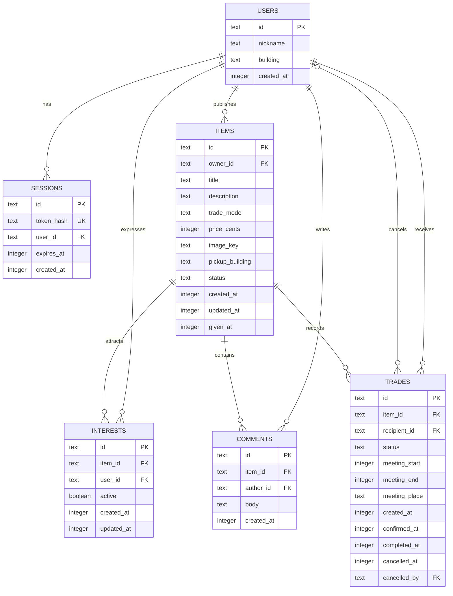

# 数据库 ER 图

状态：SRS v1.0 的逻辑设计，实际迁移须与此同步。字段约束与时间/金额单位详见 [SRS](SRS.md)。单社区名称通过配置提供，本次不建社区管理表。

- `interests(item_id,user_id)` 联合唯一；撤回通过 active=false 保留记录。
- trades 的卖方由 items.owner_id 得出，避免重复存储与不一致。
- trades 对 item_id 建立 `WHERE status IN ('PENDING','CONFIRMED','COMPLETED')` 唯一部分索引；取消记录不占用唯一名额。
- 图中的物品与交易一对多包含取消历史；不代表允许并行有效交易。
- GIVEN 与 COMPLETED 的同步、角色权限及跨表业务前提由同一个数据库事务保证。
