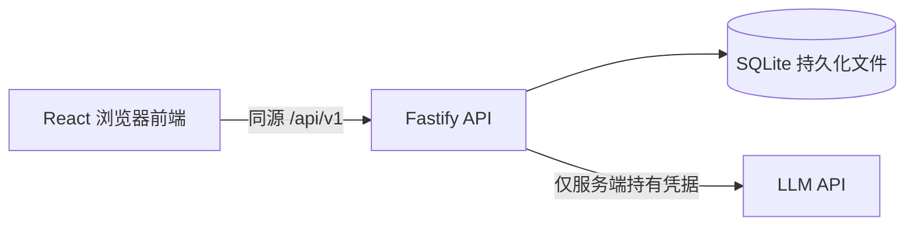

# 邻里闲置 · 软件需求规格说明书（SRS）

版本：1.0 · 日期：2026-09-27 · 状态：实现基线，非已完成能力。

需求来源：[PRD](../product/PRD.md)。概念结构采用 Chen 表示法，见 [全局实体联系图与实体属性图](ERD.md)。本文中的接口、字段、状态和验收 ID 是后续任务的共同契约；有冲突时先修正文档再修改实现。

## 1. 技术选型与系统边界

| 层 | 方案 | 决策理由 |
| --- | --- | --- |
| 前端 | React + TypeScript + Vite，React Router，CSS | 独立 SPA、移动端适配、快速建立可演示页面 |
| 后端 | Node.js 24 LTS + TypeScript + Fastify | 独立 REST API，集中认证、校验和事务逻辑 |
| 数据库 | SQLite + Drizzle ORM + better-sqlite3 | 本地单实例运行，文件持久化，版本化迁移 |
| 契约 | OpenAPI 3.1 + 共享 TypeScript/Zod schemas | 先固定协议，前端可用契约驱动的 mock 并行开发 |
| 测试 | Vitest、Fastify inject、Playwright | 规则单测、真实临时数据库 API 测试、双会话端到端测试 |
| 包管理 | npm workspaces + 单一 lockfile | 简化新环境启动；依赖版本在脚手架任务锁定 |
| LLM | 服务端调用一个实际服务商的文本生成 API | 用适配器隔离服务商，校验结构化输出 |

选型参考：[Vite 官方指南](https://vite.dev/guide/)、[Fastify 官方文档](https://fastify.dev/docs/latest/)、[Drizzle SQLite 文档](https://orm.drizzle.team/docs/sqlite/get-started-sqlite)。使用稳定兼容版本，不直接照抄文档中的候选版本安装命令。



开发模式 Vite 代理 `/api` 到后端；生产构建可由 Fastify 托管静态文件，仍保持代码和 API 边界解耦。前端不可直接读写数据库或调用需要密钥的模型接口。没有 Redis、消息队列或微服务。

```text
apps/web/src/{app,features,components,lib}
apps/api/src/{auth,modules,db,plugins}
packages/contracts/src/
docs/{product,engineering,planning,delivery}
tests/e2e/
```

## 2. 身份、访问与环境

SRS-AUTH-01：预置至少 3 位虚构用户。演示登录选择用户后，服务端签发随机 session token；浏览器只通过 HttpOnly、SameSite=Lax Cookie 持有它。数据库只保存 token 哈希，24 小时过期。切换身份撤销原 session，登出清除 Cookie；HTTPS 环境设 Secure。

SRS-AUTH-02：公开读取接口无需登录。写接口从服务端 session 推导用户 ID，不接受客户端指定 ownerId/senderId。意向名单限物主；交易明细限双方。其他用户得到 403，未登录 401。

SRS-AUTH-03：演示身份选择不是生产身份认证。`DEMO_MODE=true` 时明确显示“演示社区”；默认仅本机可访问。可选远端实例应配置入口访问口令或等效访问控制、虚构数据与 AI 限流。模式关闭时演示登录拒绝，现有演示会话也失效；本次不实现正式注册系统。

SRS-OPS-01：计划环境变量为 `DATABASE_URL`、`HOST`（默认 127.0.0.1）、`PORT`、`APP_ORIGIN`、`DEMO_MODE`、`LLM_BASE_URL`、`LLM_API_KEY`、`LLM_MODEL`。提交无密钥的 `.env.example`。服务端限制写请求 Origin 为配置的同源地址；允许无 Origin 的本地测试客户端。关闭跨域凭据访问。

## 3. 数据模型与数据库约束

ID 使用 UUID 字符串；SQLite 时间保存 UTC epoch 毫秒，API 时间使用带时区的 ISO 8601；金额使用整数分。数据库启用 foreign_keys、WAL 和有界 busy timeout。业务记录不做物理删除。

| 表 | 主要字段 | 约束与索引 |
| --- | --- | --- |
| users | id, nickname, building, created_at | 昵称 1–30，楼栋 1–30；预置虚构数据 |
| sessions | id, token_hash, user_id, expires_at, created_at | token_hash 唯一，user_id 外键；到期时间索引 |
| items | id, owner_id, title, description, trade_mode, price_cents, image_key, pickup_building, status, created_at, updated_at, given_at | owner 外键；状态+created_at+id 索引；金额与交易方式 CHECK；GIVEN 必须有 given_at，其他状态为 null |
| interests | id, item_id, user_id, active, created_at, updated_at | UNIQUE(item_id,user_id)；可撤回后重新激活；item_id+active 索引 |
| comments | id, item_id, author_id, body, created_at | 外键；item_id+created_at+id 索引；纯文本 1–500 |
| trades | id, item_id, recipient_id, status, meeting_start, meeting_end, meeting_place, created_at, confirmed_at, completed_at, cancelled_at, cancelled_by | 外键；按物品建立唯一部分索引，覆盖 PENDING/CONFIRMED/COMPLETED，排除 CANCELLED；completed_at 索引 |

SRS-DATA-01：一个物品可有多条取消历史，但最多一条未取消交易，已完成后不可创建新交易。recipient 必须是非物主的有效意向用户，此跨表规则在事务中检查。

SRS-DATA-02：交易字段约束：PENDING 的确认/完成/取消时间均为空；CONFIRMED 仅确认时间非空；COMPLETED 的确认及完成时间非空、取消时间为空；CANCELLED 的取消时间及取消人非空、完成时间为空，确认时间可空。meeting_end > meeting_start。

SRS-DATA-03：数据库迁移包含外键、CHECK 和部分唯一索引，不能只依赖 ORM 层校验。种子数据可重复运行且不覆盖用户业务记录；重置只针对显式指定的演示/测试数据库，禁止启动时自动重置。

SRS-DATA-04：种子包含 3 位用户、3 种交易方式、3 个新鲜度区间、可领取/预约/已送出状态、留言与意向。创建时间相对于 seed 执行时间生成；测试冻结时钟并使用独立临时数据库。

## 4. 输入与输出契约

SRS-API-01：前缀 `/api/v1`。正常响应 `{data: ...}`；列表 `{data: [...], page:{nextCursor: string|null}}`；失败 `{error:{code,message,fieldErrors?,requestId}}`。分页默认 20、最大 50，cursor 不透明；排序固定 `created_at DESC, id DESC`（留言为 ASC/ASC）。非法参数返回 400，不默默修正。

SRS-API-02：标题 trim 后 1–60，描述 1–2000，楼栋 1–30，留言 1–500，交接地点 1–100。imageKey 只允许预置白名单，不允许外部 URL。FREE 价格 0；FLEXIBLE 价格 null；FIXED 价格为 1–9,999,900 整数分。请求拒绝未知属性，禁止批量赋值越权。字符串作为纯文本显示。

SRS-API-03：物品 DTO 包含 id、owner 的 id/nickname/building、title、description、tradeMode、priceCents、imageKey、pickupBuilding、status、createdAt、givenAt、interestCount、viewerHasInterest、freshnessLabel、serverNow。列表与详情不泄露 session、token 或预约地点。预约 DTO 只通过交易接口提供给双方。

| 方法与路径 | 权限 | 请求 / 响应要点 |
| --- | --- | --- |
| GET `/health` | 公开 | API 和数据库可用性，不返回配置或密钥 |
| GET `/demo/users` | 演示模式公开 | 虚构用户 id/nickname/building |
| POST `/auth/demo-login` | 演示模式 | `{userId}`；200 用户 DTO 并设置 Cookie |
| POST `/auth/logout` | 当前会话 | 200 `{loggedOut:true}`，重复调用也成功 |
| GET `/auth/me` | 登录 | 当前用户 DTO |
| GET `/items` | 公开 | `q`（trim 后最多 100）、`tradeMode`、`scope=active\|archive`、cursor、limit；默认 active 含可领取与已预约 |
| POST `/items` | 登录 | title/description/tradeMode/priceCents/imageKey/pickupBuilding；201 物品 DTO |
| GET `/items/:id` | 公开 | 200 物品 DTO；不存在 404 |
| GET `/me/items` | 登录 | 我的发布，含归档，游标分页 |
| GET `/me/interests` | 登录 | 我的有效意向及物品当前状态，含归档，游标分页 |
| PUT `/items/:id/interest` | 非物主且可领取 | 无 body；200 `{active:true,count}`；重复请求不新增行 |
| DELETE `/items/:id/interest` | 非物主且可领取 | 200 `{active:false,count}`；重复撤回幂等 |
| GET `/items/:id/interests` | 物主 | 有效意向用户 id/nickname/building/createdAt，分页 |
| GET `/items/:id/comments` | 公开 | 留言与作者摘要，按时间正序分页 |
| POST `/items/:id/comments` | 登录且未归档 | `{body}`；201 留言 DTO |
| POST `/items/:id/trades` | 物主且可领取 | `{recipientId,meetingStart,meetingEnd,meetingPlace}`；201 预约 DTO |
| GET `/me/trades` | 登录 | 我作为任一方的交易，可按 status 筛选，分页 |
| GET `/trades/:id` | 交易双方 | 预约内容、双方昵称、当前状态 |
| POST `/trades/:id/confirm` | 领取者 | 无 body；200 已确认交易 |
| POST `/trades/:id/cancel` | 交易双方 | 无 body；200 已取消交易 |
| POST `/trades/:id/complete` | 物主 | 无 body；200 已完成交易及物品 ID |
| GET `/dashboard` | 公开 | 见第 6 节 |
| POST `/ai/listing-assistance` | 登录 | `{title,description}`；见第 7 节 |

HTTP 错误：400 输入错误，401 未登录，403 权限不足，404 不存在，409 状态冲突，429 限流，502 模型无效响应，503 模型未配置/不可用或数据库忙，504 模型超时。统一处理错误，不返回堆栈、SQL 或供应商原始报错正文。

关键词同时匹配标题和描述，中文子串可搜索，拉丁字母不区分大小写；`%`、`_` 按普通字符处理；查询参数绑定并转义 LIKE 通配符。搜索与 scope、tradeMode 采用 AND 组合。

### 4.1 共享契约固定值与 DTO（Issue #3）

共享实现位于 `packages/contracts`，OpenAPI 3.1 位于 [openapi.yaml](openapi.yaml)，由同一份 schema/端点定义生成。金额、状态、未知字段、输出隐私和 AI 结构使用导出的严格 Zod schema 校验；OpenAPI 的结构校验不能替代跨字段关系、权限、事务和服务器时钟校验。

- Cookie 名固定为 `neighborhood_session`，Path=/，HttpOnly、SameSite=Lax，24 小时有效；HTTPS 加 Secure，登出用相同 Path 清除。token 不进入 JSON DTO。
- 图片 key 白名单固定为 `chair`、`lamp`、`cooker`、`books`。前端提供对应本地预置图，接口不接受路径或 URL。
- 健康响应 data 为 `{status:"ok",database:"ok"}`；数据库不可用返回 503。`/demo/users` 同样返回列表信封，`page.nextCursor=null`。
- 用户摘要为 `{id,nickname,building}`。留言 DTO 为 `{id,itemId,author,body,createdAt}`，author 为用户摘要。物主意向名单每项为 `{id,nickname,building,createdAt}`，id 是意向用户 ID、createdAt 是意向建立时间；排序使用底层意向 created_at/id。我的意向每项为 `{id,item,createdAt}`，id 为意向 ID，item 为物品 DTO；仅有效意向，包含已归档物品，按意向 created_at/id 倒序。
- 交易 DTO 为 `{id,itemId,owner,recipient,status,meetingStart,meetingEnd,meetingPlace,createdAt,confirmedAt,completedAt,cancelledAt,cancelledBy}`。owner/recipient 为用户摘要；四个可空字段为 confirmedAt/completedAt/cancelledAt/cancelledBy，后者为取消方用户 ID。创建、详情、确认、取消、完成均返回完整交易 DTO；完成响应里的 itemId 指向归档物品。字段状态约束遵循 SRS-DATA-02，详情仅双方可见。
- 通用错误 code 固定为 `BAD_REQUEST`(400)、`UNAUTHORIZED`(401)、`FORBIDDEN`(403)、`NOT_FOUND`(404)、`CONFLICT`(409)、`PAYLOAD_TOO_LARGE`(413)、`RATE_LIMITED`(429)、`INTERNAL_ERROR`(500)、`SERVICE_UNAVAILABLE`(503)。领域错误为 `AI_INVALID_RESPONSE`(502)、`AI_NOT_CONFIGURED`/`AI_UNAVAILABLE`/`DATABASE_BUSY`(503)、`AI_TIMEOUT`(504)。fieldErrors 如有则为字段名到字符串数组的映射。503 健康检查使用 SERVICE_UNAVAILABLE；DEMO_MODE 关闭时身份列表和登录返回 FORBIDDEN。
- client 使用 `createClient().call(operation,{path,query,body},{signal})`，返回完整信封，自动携带同源 Cookie、校验请求和响应、无自动重试。分页 limit 在 client 中为数值；HTTP 层仅将合法整数字符串转为数值，非法值返回 400。
- 开发 mock 仅从 `@neighborhood/contracts/mock` 显式导入并以 `enabled:true` 构造。它提供静态契约样例及可覆盖的错误/空态，不模拟真实业务和持久化、不作为网络失败降级、不得接入生产。各下游任务遵循这些共享定义，不复制协议。

## 5. 状态机、事务与幂等

| 操作 | 前提 | 事务内结果 |
| --- | --- | --- |
| 创建预约 | 物主、AVAILABLE、领取人有有效意向、未来有效时间 | 插入 PENDING 交易，物品改 RESERVED |
| 确认预约 | 指定领取人、PENDING | 交易改 CONFIRMED，写 confirmed_at，物品仍 RESERVED |
| 取消/拒绝 | 交易双方、PENDING 或 CONFIRMED | 交易改 CANCELLED，写取消人/时间，物品改 AVAILABLE；不删除意向 |
| 确认送出 | 物主、CONFIRMED | 交易改 COMPLETED，物品改 GIVEN，同时写相同完成时间 |

SRS-TRADE-01：预约创建时 `now < meetingStart < meetingEnd <= now + 7天`；只做人工协调，时间经过不自动改变预约状态。用户可取消并新建，完成允许早于或晚于约定时间，代表物主确认实际已交接。

SRS-TRADE-02：预约、意向变更、留言写入、取消和完成在事务内重新读取状态。SQLite 写事务、带前置状态的条件更新与唯一部分索引共同防止竞争。两人竞争同一物品，只能一笔预约成功；冲突 409，不产生孤立交易。数据库忙返回可重试的 503，不误报成功。

SRS-TRADE-03：confirm/cancel/complete 对已处于同一目标状态的同一交易重复调用返回 200 原记录（仍先校验权限）；非法跨状态转换 409。重复 cancel 旧交易不得改变新预约或物品状态。重复 complete 不新增成交、不重写完成时间。

SRS-TRADE-04：POST 创建物品/预约不是自动可重试接口；前端禁用重复提交，结果不确定时读取“我的”列表核实，禁止自动重发。数据库保证重复预约最多一次成功。刷新前端时以服务端状态为准。

SRS-ITEM-01：新鲜度按 PRD 的精确边界计算，测试 23:59:59、24:00:00、71:59:59、72:00:00。排序只使用 created_at/id；新增留言或意向不“顶帖”。前端每分钟根据 serverNow 校正的新鲜度时钟刷新标签。

## 6. 看板与查询

SRS-STATS-01：GET `/dashboard` 返回 `{month:"YYYY-MM",timezone:"Asia/Shanghai",publishedThisMonth,completedThisMonth,activeCount,fastestItem,mostWantedItem,asOf}`。fastestItem 为 `{itemId,title,durationSeconds}` 或 null；mostWantedItem 为 `{itemId,title,interestCount}` 或 null。

SRS-STATS-02：统计口径完全遵循 PRD 5.4；有效意向为 active=true，使用唯一用户人数；最快耗时取完成与发布差，展示秒数向下取整，选择最短记录时使用毫秒精度。按单个一致性读事务获取看板，所有返回值来自同一快照，不硬编码数字。

SRS-STATS-03：发布和完成后前端失效相关列表、详情、“我的”和看板缓存；页面重新聚焦时刷新；不要求 WebSocket 或跨浏览器即时推送。无数据展示 0 和 null 对应的空态。

## 7. LLM 接口与降级

SRS-AI-01：服务端调用一个实际模型服务，base URL/model/key 只从服务端环境读取；URL 不接受用户覆盖。适配器在实施时选定并记录实际服务商协议，使用一次请求同时生成文案和建议，不引入 Agent 或联网行情检索。

响应契约：

```json
{
  "data": {
    "title": "闲置电磁炉，搬家转让",
    "description": "使用两年，功能正常，表面有划痕，因搬家转让。",
    "suggestedTradeMode": "FIXED",
    "suggestedPriceRangeCents": {"min": 3000, "max": 6000},
    "rationale": "仅根据用户描述提供参考，品牌与型号尚不明确。",
    "missingInfo": ["品牌和型号"],
    "disclaimer": "基于描述的 AI 建议，非市场行情估价"
  }
}
```

SRS-AI-02：title/description 遵循发布字段限制；rationale 最长 500；missingInfo 最多 5 项、每项最多 100。FREE 范围为 0/0，FLEXIBLE 范围为 null，FIXED 为整数且 1 <= min <= max <= 9,999,900。服务端用严格 schema 校验，disclaimer 由服务端固定写入。

SRS-AI-03：提示词要求保留事实，不虚构品牌、成色、功能或来源；缺项通过 missingInfo 表达；用户文本作为数据隔离，不作为系统指令。模型无工具或写库权限。前端分别提供“采用文案”“采用建议方式/价格”，FIXED 采用区间下限填入可编辑标价，用户最终确认发布。

SRS-AI-04：超时上限 15 秒，单次请求无自动重试；非成功或无效结构不写数据库。每用户每分钟最多 5 次、每 IP 每分钟最多 10 次，单实例内存限流；前端加载状态可取消，取消不阻断手填。无配置 503，超时 504，无效响应 502，额度/上游不可用 503，保留表单并显示可理解的反馈。

SRS-AI-05：不在日志中记录密钥、完整提示词或完整物品描述，仅记录 requestId、耗时、服务商状态和成功/失败分类。单元/CI 使用明确标识的 stub 测试；最终验收必须单独记录真实 provider/model、时间、输入摘要、结果摘要与耗时，不得将 stub 成功当真实模型通过。

## 8. 非功能与运行验收

| ID | 要求 | 验证方式 |
| --- | --- | --- |
| SRS-NFR-01 | 手机 390×844、桌面 1440×900 无溢出；键盘可操作，表单标签与反馈齐全 | Playwright 截图与人工检查 |
| SRS-NFR-02 | 非 AI 读取 API 在 1,000 物品、5 个并发客户端本地测试中 p95 <= 500ms | 记录硬件、版本、样本不少于 100 次与测量结果；不把目标当已达成 |
| SRS-NFR-03 | API 重启后物品和交易保持；迁移可在空库执行 | 临时持久化数据库重启测试 |
| SRS-NFR-04 | 所有写接口服务端校验角色、输入和当前状态；没有前端密钥 | API 越权测试、静态构建产物与日志检查 |
| SRS-NFR-05 | 业务写入请求单用户每分钟最多 60 次，JSON body 最大 32KB | 429/413 测试；AI 另有更低限额 |
| SRS-NFR-06 | 请求错误包含 requestId，健康检查检测数据库连接 | API 测试，不暴露内部细节 |

预期根命令由工程初始化任务实现：`npm ci`、`npm run db:migrate`、`npm run db:seed`、`npm run dev`、`npm run lint`、`npm run typecheck`、`npm test`、`npm run test:e2e`、`npm run build`、`npm start`。本阶段这些命令尚不存在。构建后的 start 必须支持 SPA 页面直达和 `/api/v1`，不把 API 404 回退成 HTML。

CI 在工程初始化时配置，对 push/PR 执行 lint/typecheck/unit/build；E2E 在整体验收任务加入。CI 不依赖真实模型密钥。数据库文件、环境文件、测试报告中的敏感信息不提交。

## 9. 需求追踪与测试矩阵

| 用例 | PRD | SRS | 验收场景 |
| --- | --- | --- | --- |
| AT-01 | PRD-01 | AUTH-01/02/03 | 双浏览器不同身份；未登录写入 401；他人操作 403；会话过期/登出失效 |
| AT-02 | PRD-02 | API-02, DATA-03, NFR-03 | 三种交易方式正常发布；非法价格/文本/图片拒绝；重启数据保留 |
| AT-03 | PRD-03 | API-01, ITEM-01 | 搜索+筛选+分页；中文与通配字符；时间边界、相同时刻排序、空态 |
| AT-04 | PRD-04 | DATA-01, TRADE-02 | 不能想要自己；重复点击一条意向；撤回/重激活；名单权限 |
| AT-05 | PRD-05 | TRADE-01/02 | A 发预约、B 确认；第三人不可看地点/确认；无有效意向或时间非法拒绝；并发只有一笔成功 |
| AT-06 | PRD-05 | TRADE-03 | 拒绝/取消恢复可领取；取消后重新预约；重试旧取消不影响新预约 |
| AT-07 | PRD-06 | DATA-02, TRADE-03 | 仅物主完成已确认交易；归档不可写；重复完成不重复统计；失败事务无部分写入 |
| AT-08 | PRD-07 | AI-01~05 | 真实模型成功、用户采用、手动发布；无配置/限流/超时/非法结构降级；保留草稿 |
| AT-09 | PRD-08 | API-02, TRADE-02 | 公开留言与物主回复；归档拒绝；脚本文本不执行；按时间分页 |
| AT-10 | PRD-09 | STATS-01~03 | 北京时间月边界、取消不计成交、意向去重、最短耗时、并列与空数据 |
| AT-11 | PRD-01~09 | NFR-01~06 | 双会话完整闭环、响应式、API 性能、限流、刷新一致性 |
| AT-12 | PRD-10 | OPS-01, 第 10 节 | 干净环境复现、材料完整、视频 5 分钟、证据标注真实运行与未验收项 |

表中简写均引用本文件 `SRS-` 前缀 ID。测试关注业务不变量和失败路径，不用与实现逐行同构的测试充数。

## 10. 交付物与未完成条件

最终提供：运行 README、`.env.example`、迁移与种子、Chen E-R 图（6 张实体属性图、3 张局部实体联系图、1 张全局实体联系图，每张独立提供 SVG 源与 PNG 导出）、技术栈简介、AI Coding 工作记录、验收报告、5 分钟视频文件或可访问链接。录像不得展示真实密钥。

验收报告分别列：通过、实际失败、跳过、外部阻塞。缺真实 LLM 凭据时标记 AT-08 的真实调用部分阻塞，不能关闭完整交付任务；未远端部署不影响本地必需范围通过。可选部署若启动，则必须核验 CI、部署终态、线上页面/API、数据库持久化及身份隔离。
