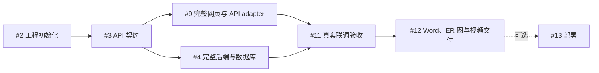

# 前后端独立开发 DAG

用户已确定以完整前端、完整后端为开发交付单元。一个会话拥有全部网页，另一个会话拥有全部 API 与数据库；两端按共享契约并行，分别自测，再做真实联调。

## 入口与真源

- Requirements: Pass — PRD/SRS 覆盖业务、数据、接口和 AT-01～12；功能范围不变，开发所有权以本文件为准。
- GitHub repository: Pass — `luochen211/neighborhood-exchange`，工程与契约已有对应 PR。
- Decision: Proceed — 按新的前后端所有权执行。
- [Epic #1](https://github.com/luochen211/neighborhood-exchange/issues/1) 聚合 6 个必需任务；#13 为可选部署。
- 实时 Issue 状态、原生 parent/blocked-by、claim、PR 与 CI 是调度真源；本文件不将启动或 Mock 演示当作完成。

## 依赖关系

箭头为前置到后续。#9 不依赖 #4，#4 不依赖 #9；两端各自完成内部路由、模块接线和测试，#11 不负责补齐任一端本应实现的页面或端点。

## 当前交付单元

| Issue | 交付 | 所有权 | 前置 |
| --- | --- | --- | --- |
| #2 | 工程、基础命令与 CI | 已建立工作区与依赖基线 | 无 |
| #3 | Schema、类型化 client、OpenAPI、显式 Mock 工具 | packages/contracts 与协议文档 | #2 |
| #9 | 完整可操作网页与 API 适配层 | 全部 apps/web、前端局部测试、docs/delivery/frontend.md | #3 |
| #4 | 全部后端 API、数据库、认证与 LLM | 全部 apps/api、迁移/种子/后端测试、docs/delivery/backend.md | #3 |
| #11 | 真正的前后端集成验收 | E2E、集成配置、验收记录、CI E2E | #9、#4 |
| #12 | 最终可交付材料 | 真实网页截图 Word、10 张 ER 图、技术说明、视频 | #11 |
| #13 | 可选托管与线上验证 | 部署配置与部署证据 | #12 |

## 前端接口边界

前端会话完整拥有首页、筛选搜索、详情、留言、发布、AI 建议采用、身份、我的列表、预约确认/取消/完成、归档与看板。可调整网页路由、全局视觉、基础组件与页面结构，无需跨前端会话交接插槽。

页面只依赖一个类型化 API adapter。HTTP adapter 使用共享契约 client，统一处理 base URL、Cookie、状态码、超时/取消、加载和错误反馈。开发 Mock adapter 通过同一契约 handler 维护内存示例状态，让前端可以独立走通交互；显式开启且界面标注。生产默认 HTTP，不将失败静默回退为 Mock，不把 Mock 打包/启用为生产数据源。

前端应交付独立预览命令、双尺寸浏览器截图、关键交互验证与 API 接入说明。切换真实后端时只改 adapter 配置，不逐页替换 URL、字段或临时数据。

## 后端接口边界

后端会话完整拥有 session、数据 schema/迁移/种子、物品、留言、意向、预约/交易、看板、LLM、健康检查、路由注册与环境解析。各模块保持内部组织，但不再拆给独立执行会话。

后端直接按 OpenAPI 和共享 runtime schema 实现，使用 API 测试独立完成两身份交易与失败路径，不等待页面完成。提供数据库初始化、迁移、启动、自测命令与无密钥环境示例。真实模型凭据不足时报告真实调用尚未验收，先完成其余功能；#11 仍以真实调用作为必需门槛。

## 共享文件与协议变更

- 两个实现会话使用各自 clone/worktree 和分支，不在同一工作区修改。
- apps/web 只由 #9 修改；apps/api 只由 #4 修改；各自允许修改本工作区 package 配置，但新增依赖须先协调。
- packages/contracts、OpenAPI、SRS 的协议内容只读。发现缺口提交协调者，以一个串行契约补丁统一更改并通知两端；不得分别造 DTO 或私自修改端点。
- 根 package.json、lockfile、CI、公共测试配置、根环境示例由协调者串行修改，两端提出具体需求。后端可先提供 workspace 级迁移命令，协调者再接入根命令。
- 前端只配置公开的 API 地址/开发模式，不包含密钥；后端环境变量留在服务端。

上述边界消除正常开发的共享文件冲突。若实际需要改共享文件，先协调，不创建虚假的前后端业务依赖。

## 执行与交接

当前两个实现负责人分别是 #9 完整前端会话和 #4 完整后端会话。开始前 fresh 读取原生依赖、claim 和 PR；依赖验收关闭后发布 DAG-CLAIM 并复读，再开展实现。每个会话负责一个完整交付单元，可在同一 Issue 内按内部模块提交增量，不需要用户手动接力。

交接应包含 Issue、分支/提交、PR、启动命令、检查结果、接口假设、已知限制与下一步责任人。执行会话提交 PR 后释放实现认领并转 Review；协调会话审查、复跑必要检查、跟进 CI 后合并并验收关闭。任务暂停或失败时保留工作，记录剩余项；过期认领先检查原分支与 PR，再决定接管。

依赖、认领、PR、Issue 或部署状态改变后重算队列。历史任务因范围被合并关闭为 not_planned 时，不视为功能验收通过，也不参与当前 Epic 完成统计。

## 验收与持续监控

前端独立交互验收与后端 API 验收分别记录；两端完成后，#11 用真实 HTTP、真实数据库与真实模型验证全链路。失败、跳过与外部阻塞分开记录。#12 交付带实际截图的 Word、6 张实体属性图、3 张局部图、1 张全局图，以及实际约 5 分钟视频。

协调任务持续推进，10 分钟 heartbeat 仅作为意外停止恢复保障；正常执行保持安静。只在完成、无法自动修复的失败或用户专属外部条件时通知。最终核验 main、CI、必需 Issue、真实运行与全部材料后关闭 Epic；可选部署不影响本地交付。

## 当前状态快照

读取时刻：`2026-09-27T02:33:03.458513+00:00`。历史 not_planned 任务不计入以下完成数。

Invalid: 0 | Unknown: 0 | Review: 1 | Claimed: 1 | Stale_Claim: 0 | Ready: 0 | Conflict: 0 | Blocked: 3 | Done: 2

### Review

- #4 实现完整后端 API、数据库与 LLM 服务 — unlocks #11; PR merged; checks success

### Claimed

- #9 实现完整 Web 前端与独立 API 适配层 — unlocks #11; claim active by complete web frontend

### Blocked

- #11 完成真实前后端联调与验收测试 — blocked by #4, #9; unlocks #12
- #12 交付运行说明、ER 图、技术简介与演示视频 — blocked by #11; unlocks #13
- #13 可选：部署受控演示站并验证持久化 — blocked by #12

### Done

- #3 建立共享 API 契约、类型与前端 Mock — unlocks #4, #9; PR merged; checks success
- #2 初始化全栈工程、开发命令与 CI — unlocks #3; PR merged; checks success
