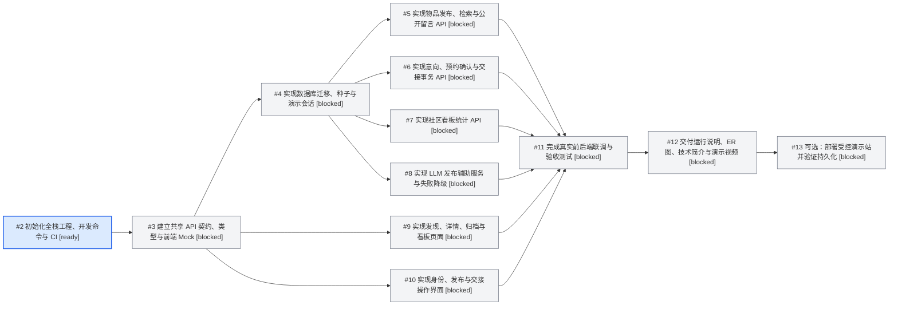

# 开发 DAG 与执行计划

本文件为 PRD/SRS v1.0 的初始交付计划和读取时刻的队列快照；任务调度以 GitHub 实时状态为准。创建 DAG 不代表已启动实现。

## 入口检查

- Requirements: Pass — [PRD](../product/PRD.md) 明确目标、范围、流程和验收；[SRS](../engineering/SRS.md) 明确接口、数据、角色、集成、约束及 AT-01～12。
- GitHub repository: Pass — `luochen211/neighborhood-exchange` 是专门创建的目标仓库，可读取 main、Issue 和 PR。
- Decision: Proceed — plan/setup 模式，建立工作图，不执行开发任务。
- [必需交付 Epic #1](https://github.com/luochen211/neighborhood-exchange/issues/1) 下有 11 个原生子任务；可选部署 #13 独立存在。

## 依赖图

箭头 A → B 表示 B 等待 A 完成，不表示 A 依赖 B。Epic 是聚合容器，不作为可执行节点参与排序。



## 任务与工时预算

| 编号 | GitHub Issue | 前置任务 | 估算 |
| --- | --- | --- | --- |
| T01 | [#2](https://github.com/luochen211/neighborhood-exchange/issues/2) 初始化全栈工程、开发命令与 CI | 无 | 2h |
| T02 | [#3](https://github.com/luochen211/neighborhood-exchange/issues/3) 建立共享 API 契约、类型与前端 Mock | #2 | 1.5h |
| T03 | [#4](https://github.com/luochen211/neighborhood-exchange/issues/4) 实现数据库迁移、种子与演示会话 | #3 | 2h |
| T04 | [#5](https://github.com/luochen211/neighborhood-exchange/issues/5) 实现物品发布、检索与公开留言 API | #4 | 2h |
| T05 | [#6](https://github.com/luochen211/neighborhood-exchange/issues/6) 实现意向、预约确认与交接事务 API | #4 | 2.5h |
| T06 | [#7](https://github.com/luochen211/neighborhood-exchange/issues/7) 实现社区看板统计 API | #4 | 1h |
| T07 | [#8](https://github.com/luochen211/neighborhood-exchange/issues/8) 实现 LLM 发布辅助服务与失败降级 | #4 | 1.5h |
| T08 | [#9](https://github.com/luochen211/neighborhood-exchange/issues/9) 实现发现、详情、归档与看板页面 | #3 | 2h |
| T09 | [#10](https://github.com/luochen211/neighborhood-exchange/issues/10) 实现身份、发布与交接操作界面 | #3 | 2.5h |
| T10 | [#11](https://github.com/luochen211/neighborhood-exchange/issues/11) 完成真实前后端联调与验收测试 | #5, #6, #7, #8, #9, #10 | 2h |
| T11 | [#12](https://github.com/luochen211/neighborhood-exchange/issues/12) 交付运行说明、ER 图、技术简介与演示视频 | #11 | 1.5h |
| T12 | [#13](https://github.com/luochen211/neighborhood-exchange/issues/13) 可选：部署受控演示站并验证持久化 | #12 | 2h |

必需任务合计约 20.5 人时，剩余 3.5 小时用于问题处理和录制重试。估算用于控制范围，不保证一定按时；多会话的等待和合并也会消耗时间。可选部署另估 2 小时，只在必需交付完成且有余量时开始。

## 当前队列

读取时刻：`2026-09-27T01:52:04.358771+00:00`。

- Ready：1（#2 工程初始化），未认领。
- Blocked：11（必需任务 10 个、可选任务 1 个），原因是上游尚未完成。
- Claimed、Stale Claim、Conflict、Review、Done：均为 0。
- Invalid、Unknown：均为 0；已通过严格校验，没有自依赖、缺失节点或环。
- 11 个原生 parent 链接和 16 条原生 blocked-by 依赖已回读核验；当前没有实现 PR 或 claim。

下一步安全动作：重新读取 #2 并认领，在独立 worktree 上完成工程初始化。#2 完成后解锁 #3；#3 完成后可开展数据库/会话 #4 与前端 #9/#10。

## 修改边界与并行条件

| 任务组 | 拥有的边界 | 并行条件 |
| --- | --- | --- |
| #2 工程 | 根配置、依赖 lockfile、全局 UI、应用与模块入口 | 先行完成，预建后续模块接入约定 |
| #3 契约 | packages/contracts、OpenAPI、client/mock | 完成后冻结；任何后续变更先协调受影响任务 |
| #4 数据库与身份 | db、auth、迁移、种子 | 后端任务共同的先决条件；只此任务拥有初始迁移 |
| #5/#6/#7/#8 后端模块 | items/comments、interests/trades、dashboard、ai 各自目录与测试 | 不互改目录；使用 db/auth/contracts 的稳定接口 |
| #9/#10 前端 | discovery/detail/archive/dashboard 与 auth/publish/me/exchange 分开 | 公共 UI 已由 #2 提供；交互组件用插槽集成；局部样式，不改全局 |
| #11 联调 | 应用接线、E2E、缺陷修复、CI E2E | 所有模块完成后统一接线，关闭生产 mock |
| #12/#13 交付 | 文档视频；可选部署配置 | 顺序执行，不争用生产环境 |

初始没有需要持久记录的 conflicts_with 边，因为文件所有权已拆开。实际实现若出现共享文件、迁移、契约、lockfile、fixture 或部署环境竞争，必须暂停相关并行修改并记录冲突，不能通过虚构业务依赖掩盖冲突。

Ready 只是满足依赖，不等于自动授权启动并行会话。每个独立会话最多认领一个任务，各自使用分支和 worktree；本次设置未启动任何开发会话。

## 实时调度与认领

真源顺序：GitHub 原生 Issue 状态及 parent/blocked-by → PR/检查 → main → 部署证据 → 本地计划。`tasks.json` 仅记录初始分解、文件范围、验收及 Issue 映射，不含实时 claim 或执行状态。

执行前至少读取：

```bash
gh issue view <number> --repo luochen211/neighborhood-exchange --comments
gh api repos/luochen211/neighborhood-exchange/issues/<number>/dependencies/blocked_by
gh api repos/luochen211/neighborhood-exchange/issues/1/sub_issues
gh pr list --repo luochen211/neighborhood-exchange --state all
```

检查关联 PR 与 checks；API 读取失败应记 Unknown，不按空列表处理。调度器归一化这些实时结果后验证节点、方向、环和声明冲突，再计算 Ready。关闭 Issue 代表调度 Done，但最终交付审计仍须检查验收证据与默认分支。

认领评论格式：

```text
DAG-CLAIM
executor: <会话名称>
session: <会话标识>
branch: codex/<task-name>
worktree: <不含敏感信息的标识>
claimed-at: <UTC ISO 时间>
heartbeat-at: <UTC ISO 时间>
expires-at: <UTC ISO 时间>
scope: <当前 Issue 文件范围>
```

发表后复读，若已有更早有效认领则撤销自己的认领。按任务长度设置租期，在有意义的进度节点更新同一评论；过期先检查分支和 PR，再记录接管。提交 PR 时转 Review 并释放实现认领，停止时记录剩余工作与最后验证提交。Claim、Issue、依赖、PR 或部署状态变化后重新计算队列。

原生关系的 API 约定可参考 [GitHub dependencies](https://docs.github.com/en/rest/issues/issue-dependencies) 和 [sub-issues](https://docs.github.com/en/rest/issues/sub-issues)。本仓库已实际写入并回读关系，不只是在正文中列出前置任务。

## 完成与外部条件

单任务完成必须满足其验收清单、相关检查通过、代码进入 main、已配置 CI/CD 到达成功终态。失败时记录首个可操作原因并在范围内修复。不能因推送成功、PR 已开或本地有代码而关闭。

真实 LLM 凭据尚未在本阶段配置：不影响 #8 的适配器和 stub 测试，但 #11 的真实调用验收必须满足；缺凭据应记外部阻塞。ER 图按 Chen 表示法交付6 张实体属性图、3 张局部实体联系图、1 张全局实体联系图，每张独立提供 SVG 源图及 PNG 导出；#12 须核对实际数据库迁移。视频是 #12 的实际交付物，脚本不能代替视频。#13 的托管资源未选定，不计入必需交付。

所有必需子任务验收和 main/CI/材料证据一致后，才核销父任务清单并关闭 Epic。当前没有 CI 工作流或部署，应用尚未实现；CI 的建立属于 #2。
